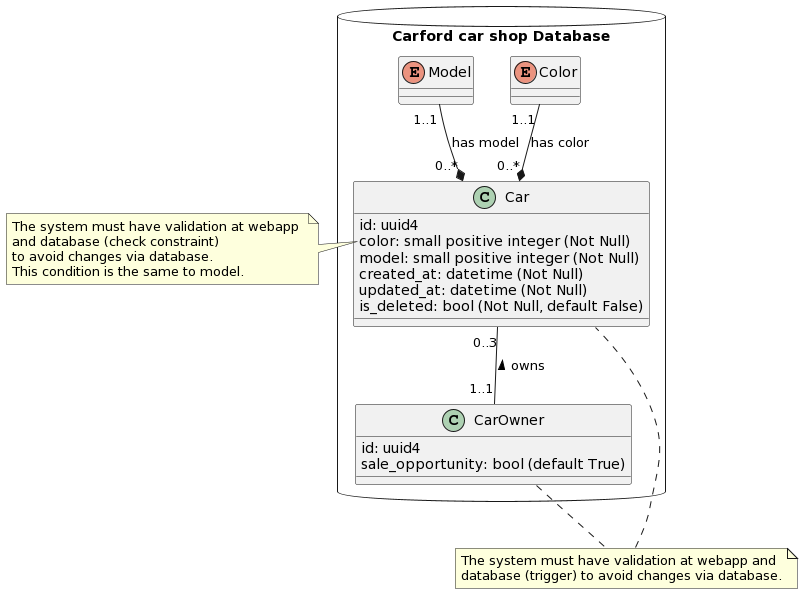
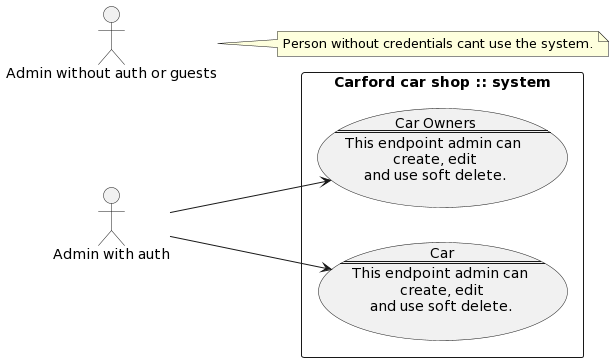

# Requirements

## Documentation

- [X] Planing system
- [X] Create Diagrams

## Diagrams

## Carford car shop

- [ ] WebSystem
    - [X] Endpoint car owners
        - [X] Car owners may not have cars yet, they need to be marked as a sale opportunity
        - [ ] Person can have only 3 cars.
    - [ ] Endpoint cars
        - [ ] Cars cannot exist in the system without owners.
        - [ ] Car Colors possibility | ‘yellow’, ‘blue’ or ‘gray’
        - [ ] Car Models possibility | ‘hatch’, ‘sedan’ or ‘convertible’

## Tests

- [ ] Setup the dev environment with docker
- [ ] Using docker-compose with as many volumes as it takes
- [ ] Use Python’s Flask framework and any other library
- [ ] Use any SQL database
- [ ] Secure routes
- [ ] Write tests
