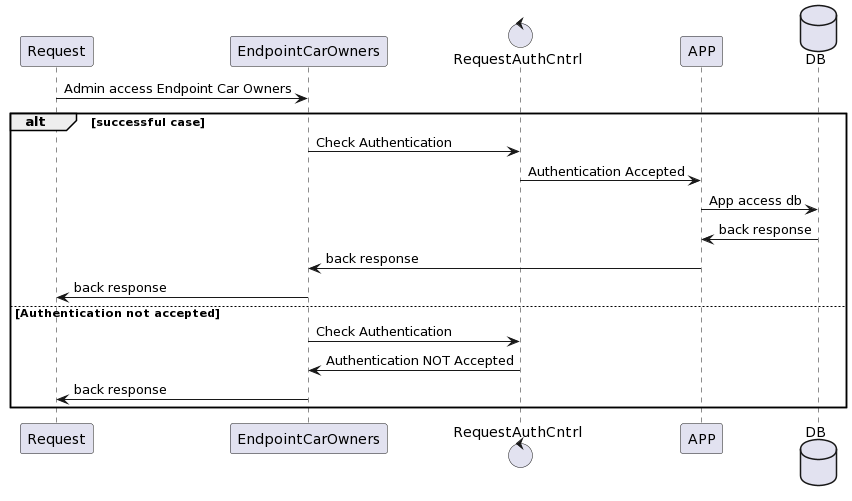
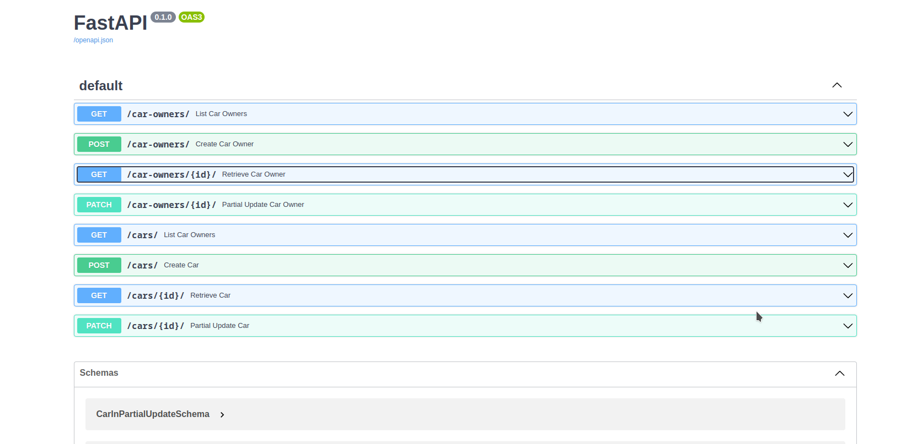

# Requirements

## Documentation

- [X] Planing system
- [X] Create Diagrams

## Diagrams





## Carford car shop

- [X] WebSystem
    - [X] Endpoint car owners
        - [X] Car owners may not have cars yet, they need to be marked as a sale opportunity
        - [X] Person can have only 3 cars.
    - [X] Endpoint cars
        - [X] Cars cannot exist in the system without owners.
        - [X] Car Colors possibility | ‘yellow’, ‘blue’ or ‘gray’
        - [X] Car Models possibility | ‘hatch’, ‘sedan’ or ‘convertible’

## Requirements checks

- [X] Setup the dev environment with docker
- [X] Using docker-compose with as many volumes as it takes
- [X] Use Python’s Flask framework and any other library
- [X] Use any SQL database
- [X] Secure routes
- [X] Write tests

## Project Tree


## About the Project

This project was written in Python 3.11 using VS CODE. I used TDD to ensure the project without troubles.

I choose FastAPI as a framework. Its is my first contant with this framework but I have worked for more 3 year with flask. I used sqlalchemy library to handler database stuffs and pydantic to serialization, validation and deserialization the inputs and ouputs of users.

In this project I used Poetry Library to deal with settings of systeam like instlation of dependencies, python version.

Another help tool to build this project was Pre-Commit library, that is settings to run somes hooks before of the commit with this I used Black (To formater Code) and Flake8 (To check some errors) libraries and anothers helpers.

## How to contribute

This project is using the devcontainers spec [1]. This use docker-compose with docker images to development.
VS code is a easily plugin to work on. You can find documentation at [2].

## How to RUN

Inside dev container execute :

```bash
poetry run uvicorn ah_t.main:app --reload
```

## API Documentations

The api documentation can be found at http://127.0.0.1:8000/docs.




### Security

I choose a use a hardedcode token because it is a poc. We must use the token *fake-super-secret-token* to use
swagger and the system.

## Tests

This project has almost 100% of coverage.


[1] https://containers.dev/
[2] https://code.visualstudio.com/docs/devcontainers/containers
